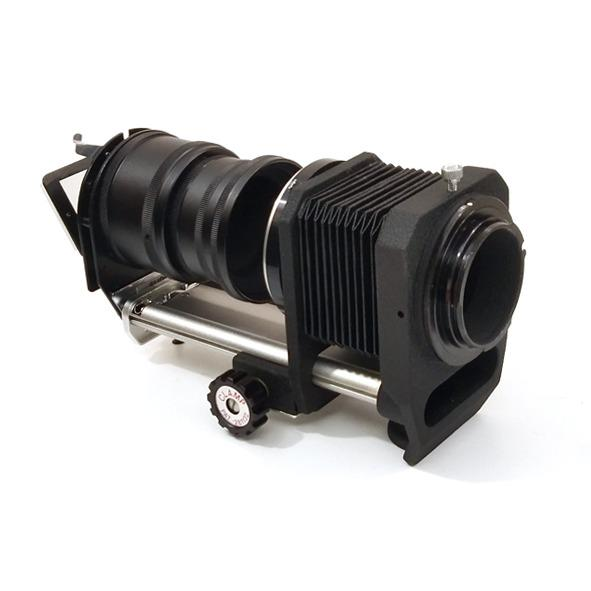
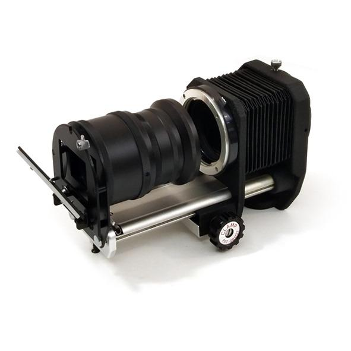

# Arduino Shutter Speed Tester

A project to build a shutter speed tester using KY-008 laser diodes, ISO203 Laser Receiver & TFT display, all driven by an [Arduino Nano](https://docs.arduino.cc/hardware/nano). The code was developed in [VSCode](https://code.visualstudio.com/) using [Platform IO](https://platformio.org/). 
 

## Status
This is a work in progress.
 

### What works:
* Measurement of shutter speeds & curtain travel times using 3 lasers and sensors
* Display time measurements & corresponding fractional shutter speeds  
* Display curtain travel times for 1st & 2nd curtain
* Calibration check
 

### To do:
* More content in this Readme, especially about calibration
* Ability to measure cameras like Barnack Leicas where you cannot access the rear of the shutter curtain.
* Finish project documentation: references, datasheets, circuit diagrams, etc. 
 

## Wiring Diagram

## Components
### Arduino Nano
The heart of the system is an Arduino Nano.

 

### Laser Diode
The [KY-008 laser diode](https://arduinomodules.info/ky-008-laser-transmitter-module/) is a 650nm (red) laser, with an output power of 5mW. It can be bought as a standalone component or in module form (KY-008). The documentation says it can operate off of 5V, but reports on the internet say it will burn out quickly and a 39 ohm series resistor is needed to drop the voltage. The module version contains this resistor. This is what it looks like:

### ISO203 Laser Receiver
It was difficult to find information on this component, but fortunately I came across a good [blog post](https://www.codrey.com/electronic-circuits/the-mysterious-laser-receiver-sensor-module/) covering it. It can be bought as a laser sensor module, or a standalone laser receiver. The module contains the components needed so you can simply plug it in to your Arduino. If you use the stand alone receiver, a pull-up resistor on the signal leg is needed.  This is what it looks like:

 

 

 

### LiPo Charger / Voltage Regulator Module
This module charges the LiPo battery and provides a constant regulated voltage to the Arduino and other electronics.

 

### TXS0108E 8 Channel Level Shifter
The Arduino uses 5V logic levels, but the TFT display requires 3.3V levels. A level shifter is needed between the Arduino and the TFT display.

 

### Display
The project started with a small 0.96 inch OLED display. But it was too small, so it was replaced by a larger TFT LCD.

##### 0.96" OLED 
 The code for the OLED display is still in the code base, it can be enabled by changing the line `#define USE_OLED 0` to `#define USE_OLED 1`. The OLED uses the i2c interface, and this is not shown on the wiring diagram.

  

 

##### TFT LCD Display
The tester was built using a 2.2 inch TFT display with 240x320 resolution and ILI9341 driver chip. A smaller or larger display could be used as long as the resolution and driver are the same. The display used had a SD Card slot on the back, this was was not used.

 
 

### Other components
Rocker switch, USB charge connector and a 550mAh 13400 battery recovered from a disposed vape. The second version added a battery indicator and normally open momentary push button to connect it to the battery to show the battery level.

 

## Mechanicals
The mechanical build is based on a Pangor M42 macro bellows, paired with 3D printed parts. The design could be adjusted to work with any bellows. 

The bellows was disassembled to remove the expanding bellows and only the rail and end housings were used. This forms the chassis to which the 3D printed parts attach. There are two housings attached, one at either end of the chassis. There is one for the laser detectors and electronics, and another for the laser diodes. Both the laser diode and laser sensor housings are circular and can be rotated to allow the sensors and lasers to be aligned. Using a macro bellows as the chassis provides a stable platform that makes sensor and diode alignment easy and keeps them aligned when sliding further apart or closer together to accommodate different cameras.

The laser detectors are kept close to the electronics to minimise the chances of false detects due to noise. 

Since the laser diodes only need power to turn them on, noise is not an issue, and they are on the end of a cable that connects them to the electronics box.

Construction photos showing details of the assembly are shown below. More photographs are available in the images directory of the project.

### Version 1

 

Version 1 of the housing was printed using blue PLA and coloured black using a liquid shoe dye. Once built it became evident that there were a few deficiencies in the design:
1) The laser diode holders were printed with three small screws at 120 degree intervals. The idea being that the screws could be used to hold the laser diodes and adjusted to aim the diode at the sensor. This idea did not work.
2) The screen was awkward to read, it needed to face the other direction.

#### Laser diodes
An old USB cable with a broken connector was used to connect the laser diodes. Both end connectors were cut off and each laser diode wired to one wire connected to an IO pin on the Arduino. A common ground was wired on the 4th wire. The current limiting resistors are soldered inline, directly between the diode and wire, covered in heat shrink to prevent shorting. A simple knot in the cable serves as strain relief.

#### Laser sensors
Each laser sensor is soldered onto a small piece of [stripboard](https://en.wikipedia.org/wiki/Stripboard) with its 10kΩ pull up resistor. They fit into specially shaped recesses on the 3D printed part and are held in place by a plate that clamps down on the back of them. They are wired with common ground and power lines, and each has its own signal line to an IO pin on the Arduino.

 

#### Display and electronics
The display and electronics are housed in a box that mounts to the laser detector housing. It was rather tight in this version.

#### Alignment
The macro bellows has two thumb screws, one on each side (red arrows in image below). The laser detector housing has a 3D printed "dimple" in the circular ring at the "12 o'clock" position that the thumb screw screws into to align it and stop it rotating. The laser diode holder does not have any "dimples", it can be rotated to align the laser diodes and sensors (yellow arrow in image below), then the thumb screw is screwed down to hold it in place.  

### Version 2

 

Version 2 of the housing corrected the issues with the first design and added a battery meter and some small improvements. A 3D printed foot was also added for stability. 

Version 2 also has some problems that will be corrected in the next version: 
 1) The display was designed to be adjustable, this turned out to be not necessary and just added complication.
 2) The housing could be made smaller.

#### Battery Meter
The battery meter turned out to be much larger than anticipated and the bottom housing needed to be made much larger. This did help with the tight fit compared to version 1, there is much more space and the electronics fit in much easier.

  
  

#### Laser Diodes
The laser diodes are now housed in a ball joint, with each ball clamped down by a small rectangular block. This allow each laser to be adjusted and aimed at the corresponding laser sensor individually. The knot in the cable has been replaced by a proper cable strain relief block that clamps the cable.

#### Camera Alignment Cone
A shallow cone screws onto the front of the laser detector housing. The camera lens mount ring is pushed onto this cone, and it helps to align the camera with the tester. 

#### Foot
A 3D printed foot is bolted onto the tripod mount on the bottom of the bellows housing to improve stability.

 

## 3D Printed Parts
The STL files for the 3D Printed parts can be found in the STL folder in the repository

# Getting Going
* Download and setup VSCode and PlatformIO. See https://dronebotworkshop.com/platformio/
* Open the project in VSCode
* Build using PlatformIO
 

# Calibration
Calibration was done using a calibration device consisting of a STM32 Nucleo-F303RE development board driving a KY-008 laser diode. This pulses the laser at regular intervals, the width of the pulse can be changed by pressing the 'user' button on the dev board. The width of the ON pulses was measured using a digital storage oscilloscope to confirm their accuracy.

The STM32 calibration device was then use to illuminate the laser receiver on the shutter speed tester to check that the tester measured and displayed the correct time.

The rise and fall times of the laser detector were also checked using the oscilloscope.

Details of the calibration device can be found in the following repo https://github.com/stuart-brown/ShutterSpeedTesterCalibrator

 

# References and Interesting Reading:
* [ISO 516:2019 Camera shutters — Timing — General definition and mechanical shutter measurements](https://www.iso.org/standard/70966.html) - This is __*the standard*__ for testing shutter speeds. You need to buy the standard, but there are various previews available online, enough to glean useful information from.

* [The Way to Modern Shutter Speed Measurement Methods A, Historical Overview, by Gyula Simon, Gergely Vakulya, and Márk Rátosi](https://www.mdpi.com/1424-8220/22/5/1871) - A paper that delves into various methods to measure shutter speeds.

* [National Camera, Technician Course, Testing Shutter Speeds](https://learncamerarepair.com/downloads/pdf/NatCam-Shutter-Test-Guide.pdf)

* [Charts of Nominal, and Precise Actual camera
Shutter speed, f stop and ISO goal values](https://www.scantips.com/lights/math.html) &  [Camera Math of photography settings and EV](https://www.scantips.com/lights/fstop2.html) - These pages contain an enlightening discussion about 'Nominal' vs 'Accurate' values and the maths behind cameras.

 
 

# Some other shutter speed testers & projects
* http://forum.mflenses.com/the-shutter-speed-meter-project-t11387.html

* https://www.pentaxforums.com/forums/8-film-slrs-compact-film-cameras/409300-optical-measurements-pentax-me-super-shutter-speed.html

* https://www.pentaxforums.com/forums/173-general-photography/359823-true-shutter-speeds-compared-nominal-shutter-speeds-actual-measurements.html

* [Laser Shutter Tester](https://community.element14.com/challenges-projects/project14/makingtime/b/blog/posts/laser-shutter-tester)

* [VFMOTO camera shutter tester](https://www.ebay.com/usr/vfmoto) - A commercial product sold on EBay

* [Film Camera Tester](https://github.com/srozum/film_camera_tester/wiki) - This one is available as a DIY kit on or assembled from [Tindie](https://www.tindie.com/products/srozum/film-camera-tester/)

* [Speed tester](https://github.com/cameradactyl/Shutter-Timer) by cameradactyl - A project very similar to this one :)
